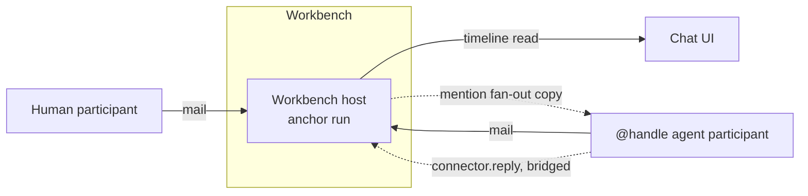

# Chat

Chat is Workbench's shared conversation surface: teams and agents read and
write the same timeline, in the same [bench](GLOSSARY.md). A message is
workbench data — a row the hub writes and reads directly — and asking an
agent for a turn is a separate act, over the mail transport Interchange
already gives every agent. It ships as two
packages — `@corbits/chat` (the HTTP surface and domain logic) and
`@corbits/chat-ui` (the React components a host renders it with) — composed
onto the hub and the web app respectively.

## What a workbench is

A workbench holds a **timeline**: the rows in `chat.workbench_messages`
belonging to that workbench, read back in order. Posting a message is one
insert plus one publish onto the workbench's live stream (CL-6327) — no mail,
no wake, no sidecar hop — so a workbench takes messages and renders them
whether or not a single agent process is running.

A workbench also has a **workbench host** (sometimes called its anchor): a
credential-free folded interactive instance that gives the workbench an
address other runs can reach. It no longer stores the timeline; a message
reaches an agent only when the workbench asks that agent for a turn.

A workbench is also its own tenant, parented under the bench it was created
in, so its membership and permissions are native grants rather than a
chat-specific system — see [workbench-tenancy.md](workbench-tenancy.md) for
the mint, listing, and move mechanics.



## The message model

A message is a list of MIME parts, not a single string. The parts a workbench
supports:

- **text** — plain message text.
- **event** — a structured, machine-readable record (e.g. a participant
  joining, a settings change) rendered distinctly from authored text.
- **attachment / file** — a named blob with a media type, referenced by id
  rather than inlined, so large files are never pulled into memory just to
  render a message list.
- **block** — a generative UI card: a `{ type, data }` envelope whose data
  is agent-authored JSON, never markup or code. The typed vocabulary lives
  in `@corbits/chat`'s `blocks` module — `approve`, `steps`, `metrics`,
  `poll`, `form`, and `stream` — and `@corbits/chat-ui` renders each type
  through a closed component registry, parsing the data at the render
  boundary so an unknown type or malformed payload degrades to a labeled
  fallback card. An approve block carries only a reference to a platform
  approval plus the agent's framing (title, risk, body): action labels are
  fixed by the client and the decision's state lives on the approval
  record, never in the message. Poll choices carry no agent-authored
  tallies. Blocks render read-only today; their controls stay disabled
  until the action round-trip ships.

A message stores its `Part[]` as it is, so reading a timeline is a query, not
a decode. Asking an agent for a turn still encodes the parts onto the
platform's mail-send shape — a single text part rides as bare mail content;
anything else becomes a list of `text/plain`/`application/json` MIME
attachments — and that encoding is confined to the dispatch seam.

## One turn in flight per workbench (CL-6331)

A workbench claims itself before it asks any agent for a turn: `dispatchTurn`
runs behind a `WorkbenchTurnQueue` (`packages/chat/src/turn-queue.ts`), keyed
by `workbenchId` rather than thread — an owner call, since a workbench's
agents share one room and a second agent starting a turn while the first is
mid-review is exactly the collision this closes. A message arriving while a
turn is already in flight for its workbench queues instead of dispatching,
and the room is told live (`chat.turn-queued`, non-persisted — a queued
message's own row already carries it on the timeline; this is only the
"still waiting" signal a client renders as a queued strip). Once the
in-flight turn's claim releases, everything that queued behind it dispatches
together as **one** next turn, recipients unioned and parts concatenated in
arrival order — never as N separate turns replaying one after another.

The claim (`packages/chat/src/turn-claims.ts`) reuses the tryClaim/release
shape `write-claims.ts` proved out for the finalized-turn write surfaces,
not the same table: a turn claim is in-memory, process-local state, released
once `dispatchTurn`'s own call settles. That is an honest, disclosed gap —
at this seam `dispatchTurn` only reaches "the mail was handed to the agent's
mailbox," not "the agent's turn actually finished" (the real turn, and its
own completion signal, move to this seam in CL-6329) — so a claim also
expires on a TTL (`turnTimeoutMs`) as the backstop against a dispatch that
never settles at all, rather than wedging a workbench behind it forever.

A host that composes more than one send surface against the same
`ChatPlatform` (the hub wires `createChatRoutes`, the workflow-participant
router, and the Slack tag mount this way) constructs one `WorkbenchTurnQueue`
and injects it everywhere, the same "one instance, shared" pattern
`workbenchSubscribers` already follows — otherwise each surface would only
serialize against its own traffic, not the others'.

## Turn = run: agents as `onTrigger` sections (CL-6329, in progress)

A turn today is mail with no identity of its own: `dispatchTurn` hands a
copy to the agent's mailbox, the agent's reply comes back through the
reply bridge, and the message row's `run_id` names the agent's _instance_,
not the turn. Two replies from one agent are indistinguishable at the row
level, and there is nothing to point at when one turn fails.

The shape that fixes it — proved out by the CL-6323 spike — is an
**`onTrigger` section keyed on (agent, workbench)**: one warm run per
pair, every message an occurrence, every occurrence its own child run with
its own run id and event log. `buildAgentTurnWorkflow`
(`packages/chat/src/agent-turn-workflow.ts`) is that definition. Its one
step is a section on the agent's own address whose body is the single
agent step that answers one message, and it carries
`onBodyFailure: "continue"` — the whole failure edge (CL-6326): a turn
that ends `failed` records the failed occurrence and leaves the section
subscribed, so one bad turn never kills the agent or the room. The
runtime names an occurrence's child run `turn__<n>`, which is what
`agentTurnChildRunId` derives and what a reply's `run_id` is meant to
carry.

Two pieces of that model are in place ahead of the dispatch cutover:

- **Context assembly** (`packages/chat/src/turn-context.ts`) —
  `assembleTurnContext` builds the conversation a turn is asked with from
  message rows: the turn's own thread (never the whole room when a thread
  is named), capped to the workbench's resolved `chat/contextWindow`, with
  the dropped span folded into one bounded recap rather than silently
  lost. It grew up inside `workbench-service.ts` as mention fan-out
  plumbing; the turn seam is now its own concern, so it is its own module.
  Thread membership lives in its own store, so the scope is injected as a
  `TurnContextThreadScope` rather than this module reaching for a second
  store.
- **The turn projection** (`packages/chat/src/agent-turns.ts`, table
  `chat.agent_turns`) — one row per turn, opened as the turn starts and
  closed as it settles, carrying the child run id, the messages it was
  asked to answer, the message it produced, and how it ended. This is
  deliberately **our** projection rather than a read of the platform's own
  run tables (the same shape gtm's event collector settled on): a room has
  to answer "which run produced this reply, and how did that turn end"
  from its own rows, at timeline speed, whether or not the execution plane
  is reachable. Occurrence allocation happens inside the insert with a
  unique index behind it, so two dispatches racing for one agent can never
  quietly share a child run id. `GET /workbenches/:id/turns` and
  `GET /workbenches/:id/turns/:turnId` serve it, following the same
  "no store, no feature" contract `pins` already does.

**Not yet cut over.** `dispatchTurn` still sends mail, because the deploy
path an agent participant actually takes (`deployAtHead` in
`@corbits/folded-runs`, which synthesizes a one-step definition and calls
`deploySingleStepAtHead`) can only deploy a single-step folded run — it
has no way to carry a section's inline body through as a referenced
definition. Teaching that path to deploy a section, and adding the
platform-port seam that fires an occurrence and observes it settle, is
what remains before the mail-dispatch edge can be retired.

## Threads: workbench → thread → sub-thread

A workbench's timeline is itself a thread — its **root thread**, one per
workbench, created lazily on first use. Any message can be replied to, which
opens (or reuses) a **depth-1 thread** anchored on that message; any message
_inside_ a depth-1 thread can be **forked**, which opens (or reuses) a
**depth-2 sub-thread** anchored on that message. That's the whole model —
workbench → thread → sub-thread, stop. There is no depth 3 (owner ruling,
CL-5908): nesting a reply off a message that already lives in a sub-thread
is rejected with an honest `409 conflict` rather than silently growing a
third level.

Forking is the first-class affordance CL-5948 adds — "something Slack
doesn't have": any message inside a thread offers **Fork**, spawning a
sub-thread rooted at it. Forking from a message already inside a sub-thread
never creates a third level; it redirects to a **sibling sub-thread** under
that sub-thread's same depth-1 parent instead. Both the redirect and the
409 share one piece of pure logic, `resolveThreadAnchor` in
`packages/chat/src/threads.ts`: given the root thread and the thread a
message currently lives in, it returns where a new thread should hang and
whether that would be a third level. `openReplyThread` (implicit replies)
refuses on that signal; `forkThread` (explicit forks) redirects on it —
neither reimplements depth math.

Every non-root thread carries a `parentThreadId` — the thread it hangs
directly off (the root thread's id for a depth-1 thread, a depth-1 thread's
id for a depth-2 sub-thread) — alongside its existing `parentMessageId`,
the origin message it answers or forks. `@corbits/chat-ui` reads
`parentThreadId` to render the breadcrumb (`Workbench / Thread / Sub-thread`,
at most three segments), to walk a fork back to its parent thread, and to
indent sub-threads under their parent in the threads menu; a forked
sub-thread also shows a small banner above its timeline linking back to its
origin message — the fork's visible back-reference.

## Participants and mentions

A workbench's participants are held in its settings as records of
`{ address, handle }`. The **handle** is the short, unique-within-workbench
name a mention actually types — `@echo`, never the underlying run's
unreadable instance id. Handles are derived from a definition's name at
invite time and de-duplicated against every handle already in the workbench
(`echo`, `echo-2`, `echo-3`, ...).

A **mention** is `@` followed by a participant's handle at a word boundary,
anywhere in a message's text. Mentioning an agent participant triggers
**fan-out**: the server sends that agent a single-recipient copy of the
message, addressed from the workbench itself rather than from the posting
principal. Sending from the workbench matters because an agent's reply
router answers the address a message came from — a principal address has
no mailbox to answer into, but the workbench's address is the mailbox every
participant already reads.

## Chats and direct messages (DMs)

`kind: "chat"` is a direct thread with exactly one counterpart, fixed at
creation and never changed afterward (`POST /workbenches/:id/invite` 409s a
chat, whichever kind of counterpart it has). The counterpart is chosen at
`POST /workbenches` time, one of:

- **An agent** — `{ kind: "chat", definitionId }`. The named definition is
  launched and joined as the chat's one participant, exactly as
  `POST /workbenches/:id/invite` joins one into a workbench (`launchAndJoinAgent`
  in `packages/chat/src/workbench-service.ts`, shared by both paths).
- **A person** — `{ kind: "chat", principalId }`. This is a **DM**: a
  two-member workbench tenancy whose second participant is an existing bench
  member, added directly with no instance to launch
  (`joinHumanParticipant`, the human-counterpart analog of
  `launchAndJoinAgent`) — a human participant reads the workbench's own
  timeline directly, so there is no mailbox to stand up, only the
  participant record and a `workbench.member-joined` audit event on the
  workbench's own timeline.

Exactly one of `definitionId`/`principalId` may be present; a `principalId`
is validated before anything is minted — it must name a real, active
`"user"`-kind principal in the calling tenant, and it can never equal the
caller's own principal id (`409 conflict`, "you cannot start a direct chat
with yourself"). Both counterpart kinds are optional on `name`: an agent
chat falls back to the agent's own handle, and a person chat falls back to
the same handle its one participant record carries — in practice always the
member's display name, since `@corbits/chat-ui`'s new-chat dialog already
has it (from the same listing Settings → People renders) and sends it as
`name` whenever the person creating the chat didn't type a custom title.

**There is no `dm: true` wire flag.** A DM is recognized the same way
everywhere it matters — `kind === "chat"` plus the absence of an
agent-shaped participant address (`isAgentAddress` in
`packages/chat/src/mentions.ts`, which is simply "does this participant's
address contain `@`" — a human participant's address is its bare principal
id). `@corbits/chat-ui`'s workbench-settings surface trims its Agents section the
same way (`workbenchSettingsSections(kind, isDm)` in
`packages/chat-ui/src/workbench-settings/model.ts` — a DM has no agent to
invite, so the section has nothing to show; Members and Danger zone are
already trimmed for every 1:1 chat, agent or person). One derivation, no
second signal to keep in sync.

## The reply bridge

An invited agent's reply is not something it posts back into the workbench on
its own — replies surface only as `connector.reply` events on that agent's
own event stream, never as mail it sends. The **reply bridge** is the piece
that turns those events into workbench messages: for each agent participant,
the platform subscribes to that agent's event stream and, on a
`connector.reply` event, posts its content onto the workbench's timeline as
a message from that agent's own address, carrying the run id it came from.

The bridge is armed when an agent is invited, and idempotently re-armed
whenever a workbench's messages are read — bridges are in-memory, so a host
restart loses them, and a read is the natural moment to notice and recreate
one.

## Bench defaults and per-workbench overrides

A workbench setting can be a bench-wide default every workbench inherits, or an
explicit per-workbench override — the same "Use bench default" vs. "Override"
shape Discord's server-default settings use. Today this applies to exactly
one setting, `chat/contextWindow` (how many prior messages a mentioned
agent sees as context):

- **Bench-wide default** — `GET`/`PATCH /bench/settings` reads and writes
  the tenant's own `chat_bench_settings` row. A bench default is never
  itself an override of anything, so it is always a plain number, never
  `null`.
- **Per-workbench override** — a workbench's own `chat/contextWindow` in its
  settings is nullable: `null` (or the key's absence) means "inherit the
  bench default," any other integer is an explicit override for that
  workbench alone.
- **Resolution** — `resolveContextWindow(workbenchSettings, benchDefault)` in
  `packages/chat/src/workbench-settings.ts` folds the two into the one
  effective value a message send actually uses, returning both the value
  and which source it came from (`"inherit"` or `"override"`). `GET`/`PATCH
/workbenches/:id/settings` include this resolved `{ value, source }` shape
  on every response, so a caller never has to re-derive it from the bench
  default and the raw workbench settings separately.

In the UI this resolved shape drives a two-state control — "Use bench
default (N)" vs. an explicit numeric field — on the workbench's own settings
panel (opened from its header, or from its sidebar row's ellipsis menu).
The bench-wide settings page only ever edits the default itself; it carries
no per-workbench editor, since a workbench's override belongs to the workbench.

## The HTTP surface

`@corbits/chat` mounts one router, under a tenant-scoped prefix, with the
following routes:

| Method & path                                                | What it does                                                                                                                                                                                                                      |
| ------------------------------------------------------------ | --------------------------------------------------------------------------------------------------------------------------------------------------------------------------------------------------------------------------------- |
| `POST /workbenches`                                          | Mints the workbench's own tenant, launches its host, writes its initial settings, and — for a chat — joins its one counterpart (an agent or a person; see [Chats and direct messages](#chats-and-direct-messages-dms))            |
| `GET /workbenches`                                           | Lists the tenant's workbenches, optionally filtered by kind                                                                                                                                                                       |
| `GET /workbenches/:id/messages`                              | Reads the workbench's timeline, decoded into parts, paginated by cursor                                                                                                                                                           |
| `POST /workbenches/:id/messages`                             | Posts a message, fanning a copy to every @mentioned agent participant. `threadId` or `inReplyToMessageId` route it into a thread instead of the root feed; a reply that would nest past depth 2 is a `409 conflict`               |
| `GET /workbenches/:id/threads`                               | Lists a workbench's threads (root, delivery, replies, and sub-threads) plus its root thread id                                                                                                                                    |
| `GET /workbenches/:id/threads/:threadId/messages`            | Reads one thread's own membership, decoded into parts — never the full workbench mailbox                                                                                                                                          |
| `POST /workbenches/:id/threads/fork`                         | Forks a sub-thread rooted at any message inside a thread (CL-5948); idempotent per origin message, and redirects to a sibling sub-thread rather than nesting past depth 2 (see [Threads](#threads-workbench--thread--sub-thread)) |
| `POST /workbenches/:id/delivery-threads`                     | Creates (or reuses) the delivery thread for a routine run                                                                                                                                                                         |
| `GET /workbenches/:id/invitable`                             | Lists the tenant's deployed definitions that can be invited into a workbench                                                                                                                                                      |
| `POST /workbenches/:id/invite`                               | Launches a definition into the workbench and adds it as a participant                                                                                                                                                             |
| `POST /workbenches/:id/move`                                 | Re-parents a workbench's own tenant to a different bench                                                                                                                                                                          |
| `GET /workbenches/:id/settings`                              | Reads a workbench's settings, including its resolved context window                                                                                                                                                               |
| `PATCH /workbenches/:id/settings`                            | Updates settings, recording each change as a timeline event                                                                                                                                                                       |
| `GET /workbenches/:id/read-state`                            | Reads the calling principal's last-seen cursor for the workbench                                                                                                                                                                  |
| `PUT /workbenches/:id/read-state`                            | Advances the calling principal's last-seen cursor                                                                                                                                                                                 |
| `POST /workbenches/:id/typing`                               | Publishes an ephemeral typing indicator to the workbench's live stream                                                                                                                                                            |
| `POST /workbenches/:id/messages/:messageId/reactions/toggle` | Toggles the calling principal's reaction with a curated emoji on a message; publishes `chat.reaction`                                                                                                                             |
| `POST /workbenches/:id/messages/:messageId/pin`              | Pins a message; publishes `chat.pin`                                                                                                                                                                                              |
| `DELETE /workbenches/:id/messages/:messageId/pin`            | Unpins a message; publishes `chat.pin`                                                                                                                                                                                            |
| `GET /workbenches/:id/pins`                                  | Lists a workbench's currently-pinned messages, decoded into parts, newest pin first                                                                                                                                               |
| `GET /workbenches/:id/turns`                                 | Lists the workbench's agent turns, newest first — each carrying the child run id its reply is traceable to (CL-6329)                                                                                                              |
| `GET /workbenches/:id/turns/:turnId`                         | Reads one turn: its child run id, the messages it answered, the message it produced, and how it ended                                                                                                                             |
| `GET /workbenches/:id/stream`                                | Server-Sent Events stream of live workbench activity, including the who's-here roster (`chat.presence`/`chat.presence.snapshot`, CL-6328)                                                                                         |
| `POST /workbenches/:id/presence`                             | Refreshes the calling principal's `lastActiveAt` on the who's-here roster; 404s with no open stream connection (CL-6328) — never polled, called on real client-side activity                                                      |
| `GET /bench/settings`                                        | Reads the tenant's bench-wide chat defaults                                                                                                                                                                                       |
| `PATCH /bench/settings`                                      | Updates the tenant's bench-wide chat defaults                                                                                                                                                                                     |

Every route runs behind the hub's tenant-scoped middleware, so the calling
tenant and principal are always resolved before a handler runs; principals
never appear in a path.

## Mounting into a host

`@corbits/chat` never talks to the platform's own HTTP API or reimplements
its session, grant, or mail machinery. Instead it depends on `ChatPlatform`:
a narrow port describing exactly what the package needs — launching a
workbench or an invited agent, dispatching mail to an agent's own mailbox,
fetching an attachment's bytes, and subscribing to live events. The timeline
itself is not on that port: it is a chat-owned table behind
`RoomMessageStore`.
A host composes this port from services it already builds (a session
service, an asset service, a sidecar router, and its database), and injects
it — along with a settings store and a grant check — into
`createChatRoutes` to get a mountable router back:

```ts
import {
  createChatRoutes,
  createDrizzleChatStore,
  createHubChatPlatform,
} from "@corbits/chat";

const chatRoutes = createChatRoutes({
  store: createDrizzleChatStore(db),
  platform: createHubChatPlatform({
    db,
    sessionService,
    assetService,
    sidecarRouter,
  }),
  requireGrant,
  turnTimeoutMs: 5 * 60 * 1000,
});

app.route("/api/tenants/:tenantId/chat", chatRoutes);
```

Any host that can build an equivalent `ChatPlatform` can mount chat the same
way — the port, not this hub, is the integration contract. `turnQueue`
(see [One turn in flight per workbench](#one-turn-in-flight-per-workbench-cl-6331))
defaults to a fresh, router-scoped queue when omitted, same as
`workbenchSubscribers`; a host that also drives sends through another
surface (a workflow-participant router, a Slack mount) constructs one
`WorkbenchTurnQueue` itself and passes it to every one of them.

## Consuming it from the UI

`@corbits/chat-ui` renders the whole chat surface — sidebar, timeline,
composer, mention picker, new-workbench and invite-agent dialogs, and the live
event stream — as a single `ChatWorkspace` component. A host supplies which
bench to talk to and the current user, and mirrors the active workbench into
its own routing. Each sidebar row also carries a hover-revealed ellipsis
menu (Rename, Pin/Unpin, Workbench settings).

Workbenches are tenants, so their settings are never a dialog: the gear icon
in the workbench header routes to a full stage surface,
`WorkbenchSettingsSurface` (`packages/chat-ui/src/workbench-settings/`) —
a breadcrumb back to the workbench, a left nav grouped Shared / Personal /
Danger zone, and the active section's panel on the right. `ChatWorkspace`
takes `settingsOpen` and `onSettingsOpenChange` the same way it takes
`workbenchId` and `onWorkbenchChange`, so the host mirrors the surface into its
own routing (`@workbench/web` mounts it at `/c/:workbenchId/settings`). The
General section still PATCHes name, pinned, and the inherit/override
context-window control; Members and Agents reuse the same invite flow
already in `invite-agent-dialog.tsx` rather than duplicating it.

```tsx
import { ChatWorkspace } from "@corbits/chat-ui";
import { listPrincipals } from "@corbits/settings-ui";

<ChatWorkspace
  tenant={tenant}
  currentUser={{ principalId }}
  workbenchId={workbenchId}
  onWorkbenchChange={(workbenchId) => navigate(`/chat/${workbenchId}`)}
  settingsOpen={settingsOpen}
  onSettingsOpenChange={(open) =>
    navigate(open ? `/chat/${workbenchId}/settings` : `/chat/${workbenchId}`)
  }
  onOpenArtifact={(part) => navigate("/library")}
  listMembers={async (tenantId) => {
    const principals = await listPrincipals(tenantId);
    return principals
      .filter((p) => p.kind === "user" && p.status === "active")
      .map((p) => ({ id: p.id, displayName: p.displayName }));
  }}
/>;
```

`ChatWorkspace` talks to `@corbits/chat`'s HTTP surface directly — a host
does not hand it a client or re-derive its API calls, only tell it where to
send them and who is asking.

`listMembers` is what puts a People tab beside the new-chat dialog's
existing Agents tab: `@corbits/chat-ui` resolves no session or tenancy of
its own (see the module note atop `chat-workspace.tsx`), so the bench's
people come from the host, the same way `tenant` and `currentUser` do —
`@workbench/web` sources it from `@corbits/settings-ui`'s `listPrincipals`,
the same call Settings → People renders from. Omitted entirely, the dialog
falls back to exactly the agent-only picker it has always been — a host
that hasn't wired a member directory yet never gets a tab that silently
fails to load.

The timeline adds a day divider between messages from different calendar
days, and renders a `file` part as a clickable artifact chip once it
carries a persisted `blobId` — a still-in-flight, `data`-only attachment
renders the same chip inert, since it has no stable id yet to open. A chip
click calls the host-supplied `onOpenArtifact`, mirroring `onOpenThread`
and `onOpenProfile`: `@corbits/chat-ui` owns no router, and today a chat
blob has no stored link back to a specific Library artifact, so the most a
host can do is navigate to the Library at large — a real per-artifact deep
link (and opening in canvas rather than navigating away) is follow-up work.

A quiet typing pulse occupies the incoming-message slot after the last
timeline message — the same left indent as the next agent reply. It
lights up from two sources: the `chat.typing` event
`POST /workbenches/:id/typing` already publishes to the live stream (see
the HTTP surface table above), and an owed agent reply that has not
streamed tokens yet. `ChatWorkspace` tracks the latest human ping with a
short expiry and resolves it to the typist's participant handle, never a
raw principal id. The who-is-typing copy is announced to assistive tech;
the visual is a small three-dot bubble. The pulse stays up across tool
rounds (`inference.done` does not wipe an empty pending) and is held for
a short floor so a fast first token cannot flash it. The signed-in
reader's own messages sit on the right, like an outgoing iMessage.

### The read path: stream events apply, they never trigger a refetch (CL-6328)

`useWorkbenchFeed` (`packages/chat-ui/src/use-workbench-feed.ts`) holds the
active workbench's messages/threads/pins as three React Query caches, and
`useWorkbenchStream` (`use-workbench-stream.ts`) is the one `/stream`
connection that keeps them current. Every event that changes what those
caches hold applies straight into the cache it describes —
`applyStreamMessage`/`applyStreamReaction`/`applyStreamPin` — rather than
invalidating and refetching: `chat.message` already carries the full
rendered row (see [the message model](#the-message-model)), and
`chat.reaction`/`chat.pin` already carry the full changed row for their own
narrow concern, so a subscriber folds the delta into state it already
holds. `applyStreamMessage` also bumps the owning thread's `replyCount`/
`lastActivityAt` in the threads cache — the one piece of thread metadata a
message row itself doesn't carry. Every apply is deduped by `id`/`clientId`,
which is what lets a reader's own optimistic send (`use-optimistic-sends.ts`)
and that same send's `chat.message` echo off the stream converge on one row
instead of a refetch reconciling them: the confirmed row is written into
the cache once, from the `POST` response, and the stream's later echo of it
is a no-op.

`refreshFeed`'s coalesced `invalidateQueries` (CL-6313) still exists, but
only as the fallback poll `useWorkbenchStream` runs while the connection
itself is down or just reopening — never as a response to a live event on
an open connection. The bar this leaves is a hard one: a stream event that
can't be applied is a missing or under-specified payload in
`packages/chat/src/stream-events.ts`, fixed there, never patched over with
a refetch in `chat-ui`.

The who's-here roster follows the same rule: `chat.presence.snapshot`
seeds it the moment the stream opens and `chat.presence` deltas
(`useWorkbenchPresenceRoster`, `workbench-presence.ts`) keep it current —
no second connection, no polled HTTP heartbeat. "Here at all" comes for
free from the open stream connection itself
(`packages/chat/src/workbench-presence.ts`); the client only calls
`POST /workbenches/:id/presence` to refresh `lastActiveAt` on real
activity (a message send, the tab coming back into view), never on an
interval.

### Reactions and pinned messages (CL-6030)

Message reactions and per-workbench message pinning (the open question left
by CL-5942) are both in scope and backed by their own tables — `message_reactions`
and `pinned_messages` — in `@corbits/chat`'s own `chat` schema (see
`packages/chat/src/schema.ts`; distinct from the sidebar's whole-workbench
`chat/pinned` setting, which is unrelated). Both are presence-as-truth:
a reaction row's existence _is_ the reaction (`./reactions.ts`'s
`toggleReaction` inserts on a miss and deletes on a hit — true on/off, never
a counter that can drift), and a pin row's existence _is_ the pin.

`GET /workbenches/:id/messages` (and `GET /workbenches/:id/threads/:threadId/messages`)
attach `reactions` (a per-emoji `{ emoji, count, reactedByMe }[]`) and
`pinned` (boolean) onto every item — extending the wire type the timeline
already consumed rather than a parallel read. Both batch over the whole
page in one query each (`listReactionsForMessages`, `listPins`), and both
fields are simply absent from the wire when the host never injects the
corresponding store, the same "no store, no feature" contract
`blockResponses` already follows.

Reactions are restricted server-side to a small curated emoji set
(`REACTION_EMOJI` in `packages/chat/src/reaction-emoji.ts`, shared with
`@corbits/chat-ui`'s picker) — an emoji outside it is a `400`, never
silently accepted. Toggling and pinning both publish onto the workbench's
existing SSE subscriber registry (`chat.reaction`, `chat.pin`), live, the
same workbench `bridgeWorkbenchStream` already bridges typing and settings
events through.

In the UI, `WorkbenchTimeline` renders a reaction chip row under each message
(click a chip to toggle; an "add reaction" trigger opens the curated
picker) and a pin/unpin toggle, both hover/focus-revealed and keyboard
operable — see `ReactionActions`/`PinActions` in `timeline.tsx`. The
pinned strip the shell mock shows above the message list
(`@corbits/chat-ui`'s `PinnedStrip`) renders every currently-pinned message
as a jump-to chip; clicking one scrolls the timeline to that message's own
row (`messageDomId`).
